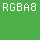
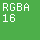
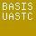

# KTX2 Samples

Collection of KTX2 sample textures, for testing and debugging.

## Preview

### 2D

**Uncompressed**

| img | vkFormat | colorspaces |
|-----|----------|------------|
|  | `R8G8B8_SRGB` | `"srgb", "display-p3"`  |
|  | `R8G8B8_UNORM` | `"srgb-linear"` |
|  | `R8G8B8A8_SRGB` | `"srgb", "display-p3"`  |
|  | `R8G8B8A8_UNORM` | `"srgb-linear"` |
|  | `R16G16B16A16_SFLOAT` | `"srgb-linear"` |
|  | `R32G32B32A32_SFLOAT` | `"srgb-linear"` |
|  | `E5B9G9R9_UFLOAT_PACK32` | `"srgb-linear"` |
|  | `B10G11R11_UFLOAT_PACK32` | `"srgb-linear"` |

**Compressed**

| img | vkFormat | colorspaces |
|-----|----------|------------|
|  | `ASTC_4x4_SRGB_BLOCK` | `"srgb"`  |
|  | `ETC2_R8G8B8_SRGB_BLOCK` | `"srgb"`  |
|  | `ETC2_R8G8B8A8_SRGB_BLOCK` | `"srgb"`  |
|  | `BC1_RGB_SRGB_BLOCK` | `"srgb"`  |
|  | `BC3_SRGB_BLOCK` | `"srgb"`  |
|  | `BC5_UNORM_BLOCK` | `"srgb"`  |
|  | `BC7_SRGB_BLOCK` | `"srgb"`  |

**Universal**

| img | vkFormat | model | supercompression | colorspaces |
|-----|----------|-------|------------------|-------------|
|  | – | `KHR_DF_MODEL_ETC1S` | `KTX_SS_BASIS_LZ` | `"srgb"`  |
|  | – | `KHR_DF_MODEL_UASTC` | – | `"srgb"` |

### 3D

       

Formats:

- `R8G8B8A8_SRGB`
- `R8G8B8A8_UNORM`
- `R16G16B16A16_SFLOAT`
- `R32G32B32A32_SFLOAT`
- BasisLZ / ETC1S
- Basis UASTC

### Array

       

Formats:

- `R8G8B8A8_SRGB`
- `R8G8B8A8_UNORM`
- `R16G16B16A16_SFLOAT`
- `R32G32B32A32_SFLOAT`
- BasisLZ / ETC1S
- Basis UASTC

### Cubemap

     

Formats:

- `R8G8B8A8_SRGB`
- `R8G8B8A8_UNORM`
- `R16G16B16A16_SFLOAT`
- `R32G32B32A32_SFLOAT`
- BasisLZ / ETC1S
- Basis UASTC

## License

Published under [CC BY-SA 4.0](https://creativecommons.org/licenses/by-sa/4.0/) license.
